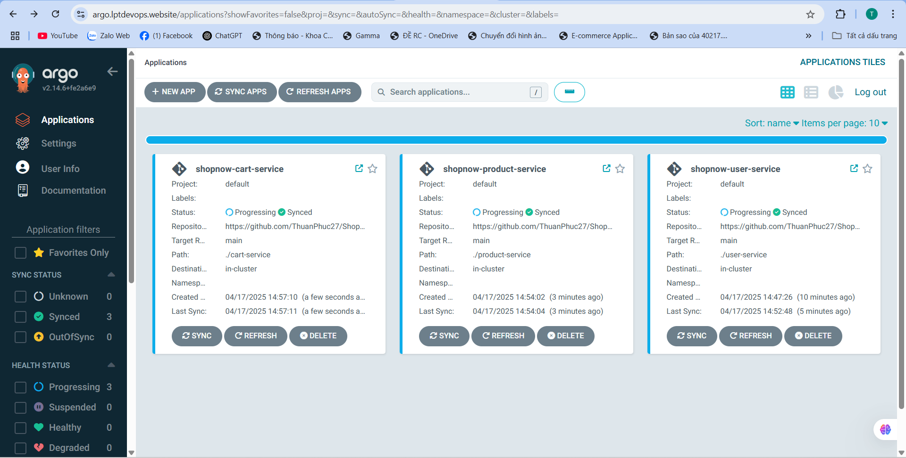
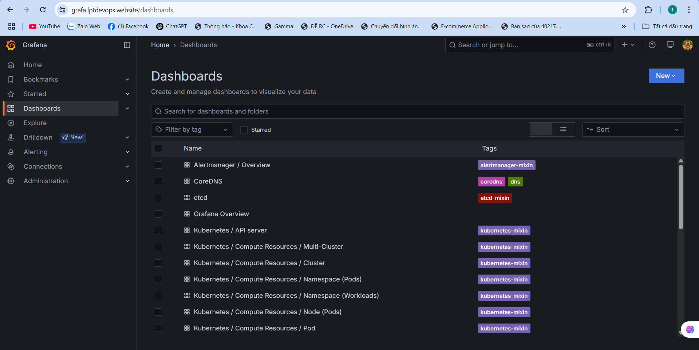
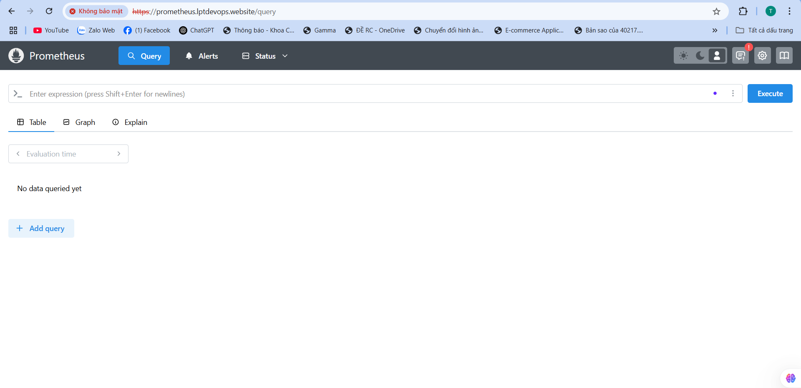
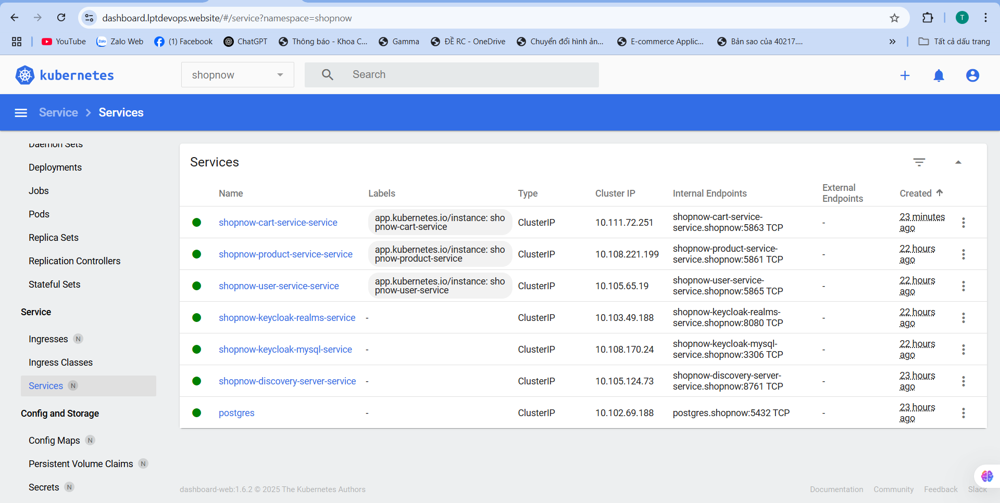
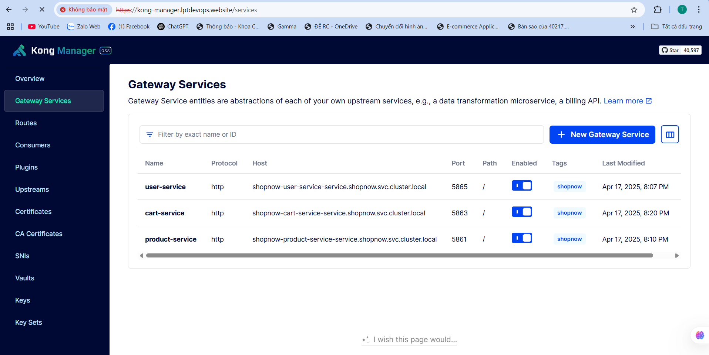

# GitOps and Observability with Kubernetes

This project showcases a comprehensive Kubernetes environment integrated with Kubernetes practices. The setup includes centralized logging, monitoring, traffic management, and automated deployment workflows.

## 📁 Infractructure Repository

🔗 [Link Infractructure](https://github.com/ThuanPhuc27/K8S_AWS_Terraform) <!-- Replace # with the actual manifest repo link -->

## 🚀 Technologies Used

- **Kubernetes** – Container orchestration platform
- **Kubernetes Dashboardr** – Kubernetes cluster management
- **ArgoCD** – GitOps continuous delivery tool
- **Argo Rollouts** – Progressive delivery with blue/green deployments
- **PNG Stack** – Prometheus, Node Exporter, Grafana for monitoring
- **ELK Stack** – Elasticsearch, Logstash, Kibana for centralized logging
- **Kong API Gateway** – API traffic management and security

## 🧠 Responsibilities

- ✅ Installed and configured key Kubernetes tools:
  - **PNG Stack** for system metrics and visualization
  - **ELK Stack** for log collection and analysis
  - **Kubernetes Dashboard** for managing Kubernetes clusters
  - **ArgoCD** for implementing GitOps workflows

- 🔄 Implemented a GitOps workflow using ArgoCD to streamline application delivery from Git to production.

- 🟢🔵 Performed **Blue/Green deployments** with **Argo Rollouts** to ensure zero-downtime updates.

- 🕒 Scheduled **automated backups** using CronTab to enhance data protection and disaster recovery capabilities.

- 🔐 Integrated **Kong API Gateway** to:
  - Secure and route traffic to microservices
  - Apply **rate limiting** to prevent DDoS attacks

## 📌 Highlights

- GitOps-based CI/CD pipeline with ArgoCD
- Zero-downtime deployment strategy
- Full-stack observability with PNG & ELK
- Secure microservices with API gateway controls

## 📸 Screenshots

###### 📌 ArgoCD - GitOps Dashboard

###### 📊 Grafana - Monitoring Dashboards

###### 📈 Prometheus - Metrics Collection

###### 🪵 ELK Stack - Centralized Logging

###### 🧩 Kubernetes Dashboard - Cluster Management

###### 🧩 Kong API Gateway

> _You can find these screenshots inside the `images/` directory of this repository._
---

> 🛠️ Feel free to fork this repository or contribute if you'd like to improve or extend the setup.

